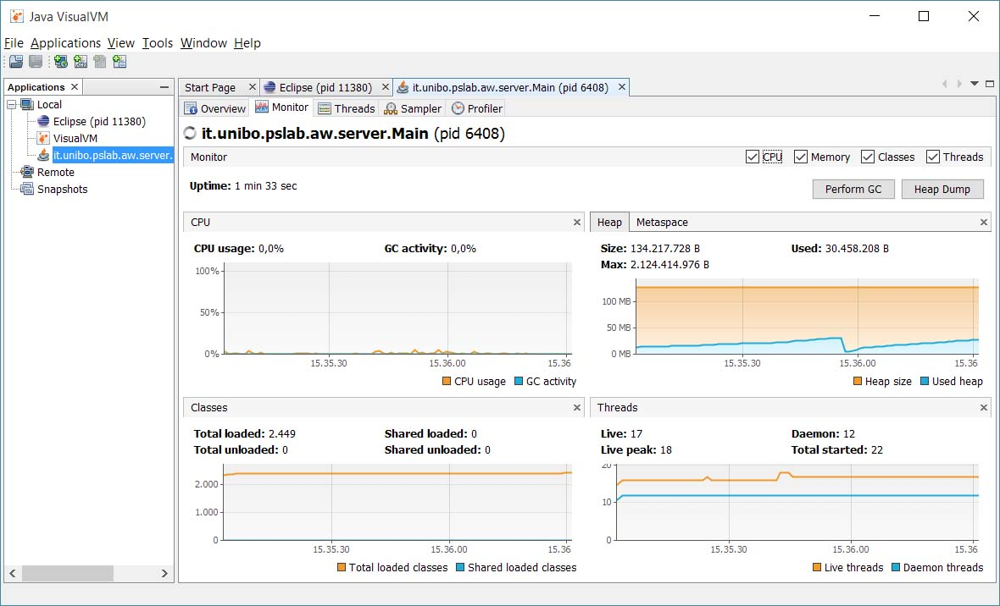

 
+++

title = "Laboratorio di Programmazione ad Oggetti"
description = "Laboratorio di Programmazione ad Oggetti, Ingegneria e Scienze Informatiche"
outputs = ["Reveal"]
aliases = ["/inspection-and-profiling/"]

+++

# Ispezione e profiling

{}

---

### Profiling di applicazioni Java

* Quando si sviluppa un'applicazione complessa, soprattutto se basata su meccanismi di concorrenza, è opportuno analizzarne il comportamento e monitorarne le performance.

* Spesso il monitoraggio delle performance è essenziale per identificare eventuali problematiche o capire l'origine di problemi che possono essere sorti.

* Tra gli strumenti che possono essere utilizzati per monitorare l'esecuzione di applicazioni che sono eseguite sulla JVM, due sono distribuiti unitamente al Java Development Kit (JDK).

* **JConsole**, lo storico (e scarno) tool per il profiling di applicazioni Java.
* **JVisualVM**, il più recente ed evoluto tool utilizzabile per monitorare l'evoluzione e le performance di applicazioni in esecuzione sulla JVM.

---

### VisualVM

* Si tratta di un *profiler* per applicazioni Java che consente di misurarne ed analizzarne le performance.
* Interagisce con la JVM (via *Java Management eXtensions (JMX)*) per fornire informazioni circa le performance e il consumo di risorse di applicazioni in esecuzione.
* Distribuito internamente al *JDK* dalla versione 5.0
* Consente di monitorare:
    * la percentuale di CPU utilizzata da singoli metodi, thread, ..
    * per quanto tempo un thread si trova nello stato di running oppure in stato di blocco o di idle.
    * ...
* Richiamabile attraverso il comando `jvisualvm` o `visualvm` (dipendentemente dalla distribuzione Java).

---

### VisualVM - Overview

---

### VisualVM - Monitor

---

### VisualVM - Threads Status

---

### VisualVM - Thread Dump Example

