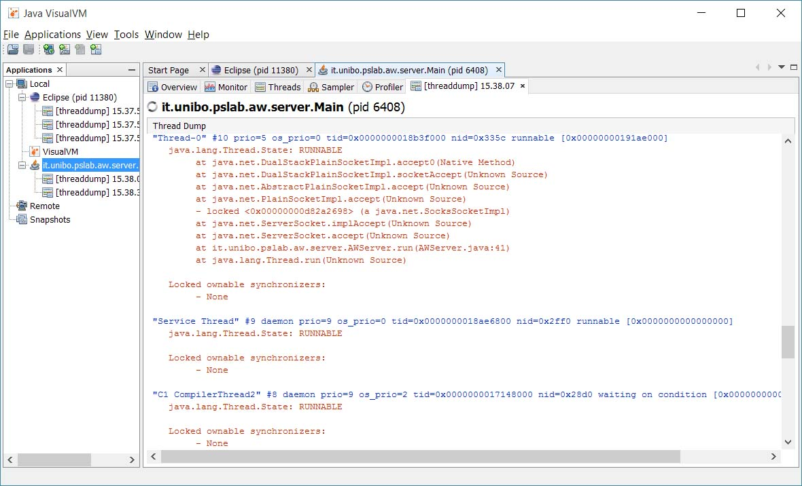

 
+++

title = "Laboratorio di Programmazione ad Oggetti"
description = "Laboratorio di Programmazione ad Oggetti, Ingegneria e Scienze Informatiche"
outputs = ["Reveal"]
aliases = ["/profiling-with-visualvm/"]

+++

# Profiling con VisualVM

{}

---

### Introduzione all'analisi delle performance di applicazioni

- Due approcci
    * Approccio *top-down*: ci si focalizza sulle parti top-level di un'applicazione e si scende ai livelli inferiori per identificare problemi ed opportunità di ottimizzazione
    * Approccio *bottom-up*: ci si concentra ai livelli più bassi (ad es. sulle inefficienze a livello di CPU) e si risale verso le applicazioni
- *Monitoraggio* delle performance: osservazione e raccolta dati *non invasivi* di un'applicazione in esecuzione
- *Profiling* delle performance: osservazione e raccolta dati *potenzialmente invasivi* di un'applicazione in esecuzione
    - *Method profiling*: fornisce indicazioni sul tempo d'esecuzione di metodi
    - *Memory profiling*: fornisce informazioni sull'utilizzo di memoria delle applicazioni Java (allocazione di oggetti etc.)
- Monitoraggio e profiling fanno parte del cosiddetto *performance testing*
    - E' un tema molto articolato
        - Hunt, Charlie, and Binu John. *Java performance*. Prentice Hall Press, 2011.
        - Oaks, Scott. *Java Performance: The Definitive Guide: Getting the Most Out of Your Code.* " O'Reilly Media, Inc.", 2014.
    - La valutazione delle performance si può effettuare in modo automatico attraverso programmi/test noti come *benchmark* (o *micro-benchmark* se si concentrano su piccoli porzioni di un programma)

---

### Monitoraggio/Profiling di applicazioni Java

* Quando si sviluppa un'applicazione complessa, soprattutto se basata su meccanismi di *concorrenza*, è opportuno analizzarne il comportamento e monitorarne le performance.

    * Spesso il monitoraggio delle performance è essenziale per identificare eventuali problematiche o capire l'origine di problemi che possono essere sorti.

* Tra gli *strumenti* che possono essere utilizzati per monitorare l'esecuzione di applicazioni che sono eseguite sulla JVM:

    * *JConsole*, lo storico (e scarno) tool per il profiling di applicazioni Java.
        - incluso nel JDK
    * **JVisualVM**, il più recente ed evoluto tool utilizzabile per monitorare l'evoluzione e le performance di applicazioni in esecuzione sulla JVM.

---

### VisualVM

* Si tratta di un *profiler* per applicazioni Java che consente di misurarne ed analizzarne le performance.
* Interagisce con la JVM (via *Java Management eXtensions (JMX)*) per fornire informazioni circa le performance e il consumo di risorse di applicazioni in esecuzione.
* Precedentemente incluso nel JDK... ora distribuito come tool standalone
    * scaricabile da [https://visualvm.github.io/](https://visualvm.github.io/)
* Consente di monitorare:
    * la percentuale di CPU utilizzata da singoli metodi, thread, ..
    * per quanto tempo un thread si trova nello stato di running oppure in stato di blocco o di idle.
    * ...
* Richiamabile attraverso il comando `jvisualvm` o `visualvm` (dipendentemente dalla distribuzione Java).
* Fornisce vari *plugin* per analisi specifiche (ad es. *Visual GC*, *Tracer-Swing Probes*, o *Startup Profiler*)

---

### VisualVM - Overview

---

- La vista `Applications` elenca le applicazioni locali/remote monitorabili ed eventuali *snapshot* (fotografie dello stato di applicazioni)
    - Le applicazioni locali sono *automaticamente identificate* 
* Per *monitorare* un'applicazione, si clicchi due volte sulla entry corrispondente in `Applications`
    - *Overview*: PID, host, main class, argomenti, JVM, versione di Java...
    - Dati salvati: thread dump, heap dump, snapshot
    - Altri tab discussi nelle slide seguenti

---

### VisualVM - Monitor

---

- Il tab `Monitor` riporta dati riguardo:
    - *CPU*
    - *Memoria (heap e metaspace)*
    - *Classi*: numero classi caricate
    - *Thread* (*live* e *daemon*)
- E consente di effettuare le seguenti azioni:
    - Attivazione di un ciclo di GC
    - *Heap dump*: una fotografia dello heap dell'applicazione

---

### VisualVM - Threads Status

---

- Il tab `Threads` riporta il dettaglio dei thread dell'applicazione
- E consente di effettuare un **thread dump**, riportante *una fotografia dei thread attivi, il loro stato, stacktrace*, etc.
    - l'analisi di un thread dump può aiutare a diagnosticare situazioni di deadlock o di
    - un esempio alla slide successiva

---

#### VisualVM - Thread Dump Example

---

### Altre funzionalità

**Sampler**

- Consente di monitorare l'applicazione prendendo dei campioni di dati (thread dump) a intervalli regolari
- Sampling dell'utilizzo della CPU o della memoria

**Profiler**

- Consente di effeatture il profiling dell'applicazione, "instrumentando" classi e metodi
    - E' un monitoraggio potenzialmente invasivo, ma consente di ottenere dati più precisi rispetto al sampling
- *CPU profiling* fornisce tempo totale d'esecuzione e numero di invocazioni per ogni metodo
    - si realizza facendo sì che ogni thread emetta un evento con timestamp all'ingresso/uscita di ogni metodo

