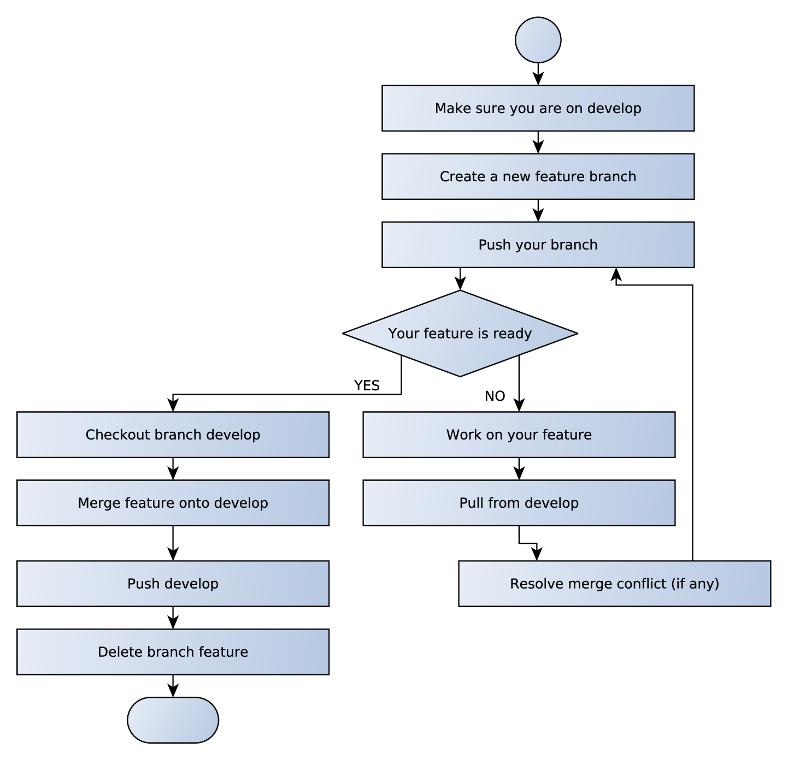

 
+++

title = "Laboratorio di Programmazione ad Oggetti"
description = "Laboratorio di Programmazione ad Oggetti, Ingegneria e Scienze Informatiche"
outputs = ["Reveal"]
aliases = ["/dvcs-workflow/"]

+++

# DVCS Workflow

{}


---

### Dalle puntate precedenti

#### DVCS


* DVCS sono strumenti potenti per tenere traccia in maniera efficiente della storia di un progetto
* Nascono in particolare come evoluzione dei tradizionali VCS (SVN, CVS ...)
* Enfasi su una **miglior gestione del lavoro di team**


#### DVCS e teamwork

		
* "La potenza è nulla senza controllo!"
* Ovvero ... la mancanza di un metodo chiaro e condiviso per utilizzarli può portare a risultati **DEVASTANTI**
    * effort necessario per la parte di gestione diventa presto preponderante e insostenibile
* Ecco perché è bene adottare un **workflow collaborativo**

    * i vostri progetti e i vostri partner di progetto vi ringrazieranno!

---

### Quale workflow

        
* Come si sceglie un workflow?
* Abbiamo parlato di semplicità...
* In realtà è più corretto parlare di giusto **trade-off** tra semplicità ed esigenze

---

### Lo stato dell'arte: **git-flow** 

Definito da *Vincent Driessen* e spiegato in ["A successful git branching model"](http://nvie.com/posts/a-successful-git-branching-model/)


---


#### Alcune considerazioni


* Non lo useremo
    * troppo complicato per i nostri scopi
* Comunque molto interessante perché racchiude tutti gli aspetti di un DVCS workflow
* Usiste lo strumento `git-flow` (un wrapper attorno a git) che può essere installato per supportare il worflow "git flow"

---

#### I branch


* Sono il supporto fondamentale alle fasi del ciclo di vita del software
* Ogni fase/attività ha il proprio branch!
* Branching e merging all'ordine del giorno!

A proposito della *nomenclatura* dei branch

- Tipici nomi sono, ad esempio `feature-<feature-name>` o `bug-<bug-name>`
- Si usa infatti categorizzare i branch in *gruppi*: `wip`, `feat`, `bug` ...
- Varie convenzioni possono essere adottate (l'importante è essere consistenti)
    - Uso degli slash come separatori: `feature/<feature-name>`, `bug/<bug-name>`
        - Alcuni strumenti potrebbero dedurre una vista tree-like
    - Aggiunta di "compontenti" al nome del branch, relativi ad es. 
        - all'autore/responsabile
        - a una *issue* (cf. Issue su GitHub) o *ticket*, o l'ID di un task o user story
- Nota: questi aspetti di nomenclatura e formattazione sono importanti anche a livello di commit (cf. [conventional commit](https://www.conventionalcommits.org/en/v1.0.0/))


---

### Un modello più semplice


* Un *branch principale*
* *Feature branch* diversi e indipendenti, per sviluppi diversi
    * da sincronizzare attraverso il branch principale (*frequentemente* per ridurre possibilità di conflitti complessi)


---

### Feature branch: processo

- nel modello semplificato (assumendo il branch principale si chiami `develop`) o in git flow



---

```bash
# Create a new feature branch from develop and share it
git checkout develop
git checkout -b feature-mynewfeaturename
git push origin feature-mynewfeaturename

# WHILE your_feature_is_unfinished
# work on your feature:
git add mynewfiles
git add mymodifiedfiles
git add mydeletedfiles
git commit -m "my commit message"
# Merge develop in to prevent big merge conflicts!
git pull origin/develop
# You may need to solve a merge conflict here!
# Share and save your work
git push
# END-WHILE

# Merge feature onto develop
git checkout develop
git merge feature-mynewfeaturename

# Push develop
git push

# Delete feature branch
git branch -d feature-mynewfeaturename
```


---

### Il repo ufficiale del vostro progetto

	
#### Approccio 1: workflow semplice

		
* Qualcuno di voi agirà come "repo maintainer"
    * Creerà quindi il repository su GitHub
* Gli altri membri del team faranno la `clone`
* Ciascuno lavorerà parallelamente sul proprio repository locale (working copy), condividendo tramite `push` e `pull` il proprio lavoro con gli altri

---
	
#### Approccio 2: workflow avanzato

Ottimo per progetti di grosse dimensioni e/o per team molto eterogenei, dove qualcuno deve assicurarsi della qualità del codice prodotto da altri.

* Il maintainer crea il repository, ed è l'unico col diritto di scrittura
* Gli altri membri del team hanno una **fork** a testa
* Ciascuno lavora su una working copy, facendo pull dal repository "centrale" e push sulla propria fork
* Quando una feature è completa, o si arriva ad un buon grado di sviluppo, si apre una **pull request**
* Il maintainer revisiona il codice, assegna eventuali modifiche, e quando è soddisfatto accetta la pull request facendo il merge del codice nel repository principale

Questo workflow è un overkill per il progetto di OOP

* Ma è possibile che vi chiederemo di lavorare così, se farete tesi o un tirocini relativi ad alcuni nostri software


